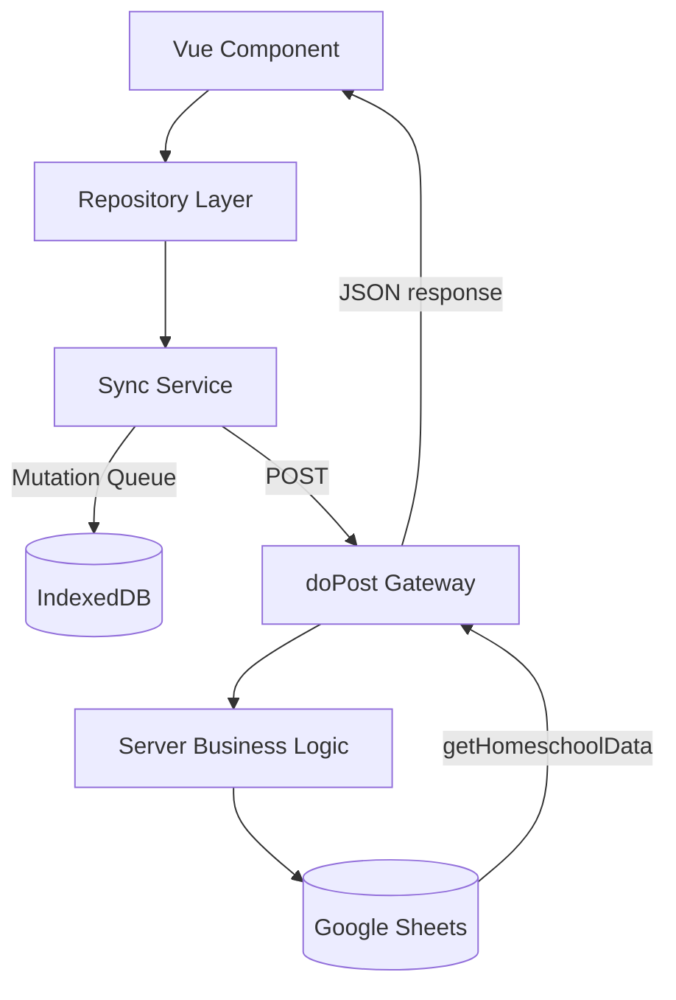

# 🏫 Yug Homeschool App: Product & Technical Documentation

Welcome to the comprehensive documentation for the **HomeShoolAppVue** project. This document serves as both a high-level overview for non-technical stakeholders and a technical deep-dive for developers.

---

## 1. Project Overview
The **Yug Homeschool App** is a high-performance, offline-first Progressive Web Application (PWA) designed to manage curriculum, track daily progress, and log educational activities. It bridges the gap between the simplicity of **Google Sheets** and the complex needs of a modern educational management system.

*   **Core Mission**: To provide a seamless, mobile-optimized experience for homeschoolers to plan lessons and track student mastery without requiring a constant internet connection.
*   **Primary Tech Stack**: 
    *   **Frontend**: Vue 3 + Tailwind CSS 4 + Vite.
    *   **Backend**: Google Apps Script (GAS) acting as a REST API gateway.
    *   **Database**: Google Sheets (Spreadsheet-as-a-Database).

---

## 2. Feature List & Business Purpose

| Feature | Business Purpose |
| :--- | :--- |
| **Curriculum Manager** | Organize educational content into Subjects and Lessons. |
| **Daily Dashboard** | Real-time overview of "Learned Today" tasks and streaks. |
| **Weekly Planner** | Move lessons into the active "Weekly Plan" for focused study. |
| **AI Task Generator** | Use Google Gemini AI to break down complex lesson titles into actionable tasks. |
| **Offline Sync** | Ensure data is never lost, even in areas with poor connectivity (Sync later). |
| **Attendance & Time Logs** | Track legal homeschooling requirements (hours and days). |
| **Portfolio & Assessment** | Capture photos and scores of work for end-of-year reporting. |
| **Gamification** | Boost student motivation through XP, Levels, and Streaks. |

---

## 3. Detailed Feature Breakdown

### 🧠 AI-Powered Task Generation
Parents often struggle to break a broad topic (e.g., "The Water Cycle") into daily tasks. The app integrates with **Gemini 1.5 Flash** to provide a list of ordered tasks based on the child's age.
*   **Logic**: `appsscript/server/Tasks.js` → `generateLessonTasksWithGemini()`.

### 🔄 Progressive Offline-First Engine
The app handles "Lie-Fi" (slow connections) by using a local fetch-based heartbeat to confirm real internet access.
*   **Queueing**: Failed mutations are stored in IndexedDB and retried automatically when the network recovers.
*   **Optimistic UI**: Components reflect state changes immediately, assuming the sync will eventually succeed.

---

## 4. Architecture Overview

### Frontend Architecture
*   **Framework**: Vue 3 (Options & Composition API).
*   **Styling**: **Tailwind CSS 4** for high-end, glassmorphic UI components.
*   **State Management**: `dataStore.js` (Reactive Vue `ref` objects).
*   **Storage**: **IndexedDB (idb)** for caching large datasets (Subjects/Lessons) and local mutation queues.

### Backend Architecture (Google Apps Script)
*   **Gateway**: `Code.gs` handles `doPost` requests, routing actions to specific server modules.
*   **Modularity**: Logic is split into `SubjectsLessons.js`, `Tasks.js`, `Planner.js`, etc.
*   **Persistence Layer**: Directly interacts with the active Spreadsheet using `SpreadsheetApp`.

---

## 5. Data Flow (Vue ↔ API ↔ Sheets)



1.  **User Action**: User marks a task as "Learned Today".
2.  **Repository**: `taskRepository.updateTask()` is called.
3.  **Smart Dispatch**: `apiService.js` checks for "Actual Internet".
4.  **Local Cache**: Data is updated in the local Vue store and IndexedDB immediately.
5.  **API Call**: A fetch request hits the GAS `SCRIPT_URL`.
6.  **Backend Execution**: GAS identifies the `updateTask` action, writes the row to the `LessonTask` sheet, and logs it in `Progress Tracker`.

---

## 6. Component Structure
The UI is built with a nested architecture for modularity:

*   **GoogleSheetApp.vue**: The hub component managing navigation and global synchronization.
*   **DashboardView.vue**: Smart widgets for streaks and "Learned Today" status.
*   **CurriculumView.vue**: Accordion-style layout for Subjects → Lessons.
*   **LessonDetailView.vue**: Detailed view for reading lesson content and tracking tasks.
*   **PlannerView.vue**: Drag-and-drop style selection for the weekly curriculum.
*   **ProfileView.vue**: Gamification stats (Level, XP, Badges).

---

## 7. Folder Structure Explanation

```text
/
├── appsscript/           # Backend Code (deployed to GAS via clasp)
│   ├── Code.gs           # API Router (doPost)
│   └── server/           # Business logic modules (Tasks, Subjects, etc.)
├── src/                  # Frontend Source
│   ├── components/       # Vue UI components grouped by feature
│   ├── repositories/     # Data abstraction layer (Domain logic)
│   ├── services/         # Cross-cutting concerns (Sync, Offline, PWA)
│   ├── stores/           # Global reactive state
│   └── api.js            # Fetch wrapper and Endpoint config
├── public/               # Static assets & PWA icons
└── vite.config.js        # Build tool config (PWA & Tailwind setup)
```

---

## 8. API Documentation (REST Actions)

The backend exposes the following primary functions via the `doPost` JSON payload:

| Action | Arguments | Purpose |
| :--- | :--- | :--- |
| `getHomeschoolData` | `none` | Returns the entire application state (Subjects, Lessons, Settings). |
| `saveSubject` | `id, name, desc` | Creates or updates a curriculum subject. |
| `saveLesson` | `lessonId, subjId, name...` | Adds a lesson to a specific subject. |
| `updateLesson` | `id, status, target...` | Updates progress counts or "Watchlist" status. |
| `updateTask` | `taskId, lessonId, learned` | Marks a specific sub-task as completed. |
| `generateLessonTasksWithGemini` | `lessonId, name, age` | Triggers AI generation for sub-tasks. |
| `saveAppSettings` | `settingsObj` | Updates global prefs like `childAge` or `weekStartDay`. |

---

## 9. User Roles & Permissions

> [!NOTE]
> Currently, the application is designed for a **Single-Student / Solo-Parent** environment.

*   **Administrator (Parent)**: Has access to all CRUD operations (Create/Delete Subjects and Lessons). Accesses the app to plan the week and review progress.
*   **Student (User)**: Focuses on the Dashboard and Lesson Details. Permissions are "Open" by default to allow the student to self-manage progress.
*   **Future**: Role-based access control (RBAC) is suggested for multi-child households.

---

## 10. Future Enhancement Suggestions

1.  **AI Progress Analysis**: Use Gemini to analyze daily progress logs and suggest topics the student is struggling with.
2.  **Google Calendar Integration**: Automatically sync "Weekly Plan" items to a Google Calendar.
3.  **Multi-Child Support**: Architecture is ready for a "ChildSwitcher" feature.
4.  **Automatic PDF Reports**: Generate end-of-term PDF progress reports with one click.
5.  **Community Hub**: Share lesson plans with other users of the app.

---
*Documentation generated by Antigravity AI on 2026-04-10.*
